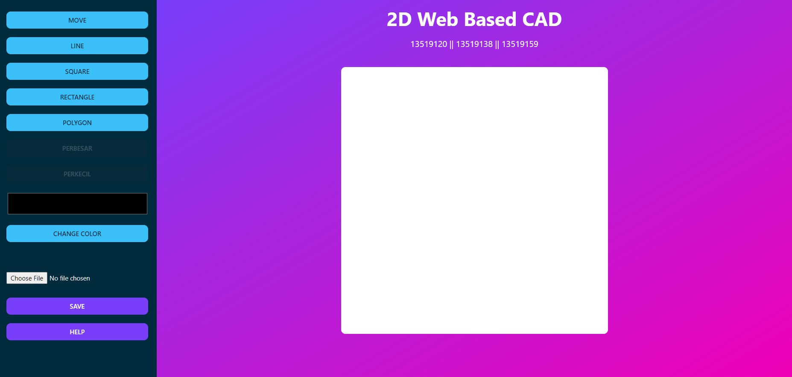
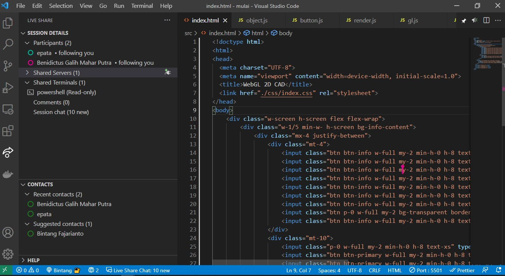

# 2D-Web-Based-CAD

Basic example of 2D Web Based CAD (Computer-Aided Design)

### Setup Pertama Kali
1. Git clone repo
2. Pada root, ketikkan perintah `npm i`
3. Ketikkan perintah `npx tailwindcss -i ./src/css/tailwind.css -o ./src/css/index.css --watch`

###  Cara menjalankan program
Buka index.html di browser Anda

### Proses Pengerjaan
Pengerjaan Tugas Besar dilakukan melalui fitur _live share_ pada Visual Studio Code. Berikut merupakan gambar saat mengerjakan melalui _live share_ Visual Studio Code.

### Kontribusi
Nama | Kontribusi | 
--- | --- | 
Epata Tuah (13519120) | garis**, persegi, persegi panjang, mengubah ukuran sisi persegi,  set up canvas on webgl**, set up design** | 
Bintang Fajarianto (13519138) | garis, polygon**, mengubah panjang garis, menggeser titik kontrol/simpul dengan mouse, set up canvas on webgl**, set up design**, | 
Benidictus Galih Mahar Putra (13519159) | Polygon, garis**, mengubah warna semua jenis model (input bebas), set up canvas on webgl**, set up design, menu Help, save and load file | 

** : Kontribusi saling bersilangan antara satu sama lain karena pengerjaan dilakukan menggunakan fitur _live share_
